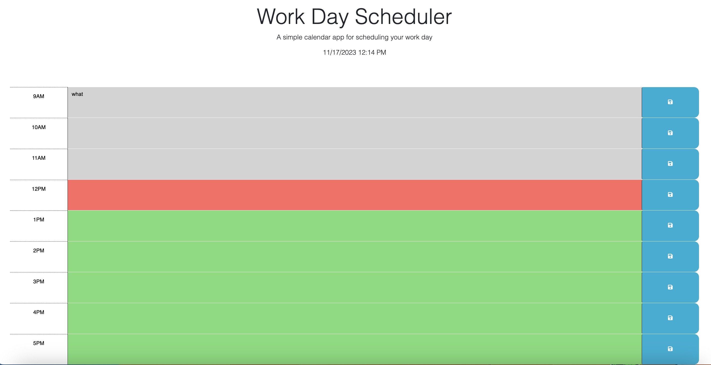

# work_day_scheduler
a simple calendar application that allows a user to save events for each hour of a typical working day
## Acceptance Criteria
>GIVEN I am using a daily planner to create a schedule
>WHEN I open the planner,
>THEN the current day is displayed at the top of the calendar.

`dayJs` api provides the current date and time. 

>WHEN I scroll down,
>THEN I am presented with time blocks for standard business hours of 9am >to 5pm.

as seen on the screen. 

>WHEN I view the time blocks for that day,
>THEN each time block is color-coded to indicate whether it is in the >past, present, or future.

`dayJs.hour` is used to compare against the div id which matches the time slot. 

>WHEN I click into a time block,
>THEN I can enter an event.

you are able to type in the text area. 

>WHEN I click the save button for that time block,
>THEN the text for that event is saved in local storage.

part of the event listener for the save buttons is to store the value of the text area in local storage. 

>WHEN I refresh the page,
>THEN the saved events persist.

the `displayToDo()` function takes care of that. 

## What I Learned

This was a fun project because i used way less javascript to accomplish the task than I first anticipated. I really see the value in third party api's such as bootstrap, dayJs, and jQuery. I think jQuery provides a very useful way to traverse the DOM. For example in line 84 of my script.js file, I thought being able to call `btn.previousElementSibling` was almost a cheat. I also learned a new way of using the `document.querySelector` on line 67 by comparing the key in the array to the id of the div. Overall it was a very useful project

## Screenshot

## Deployed Application
[Simple Calendar Web App](https://torysnopl.github.io/work_day_scheduler/)

### Source Code
source code was provided by U of O coding bootcamp and can be seen in the initial commit of my repo. special shoutout to Joem at askBCS who helped immensly with the displayToDo function.